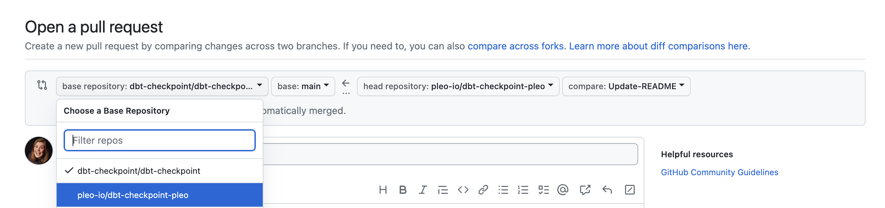

> :warning: This repository was archived automatically since no ownership was defined :warning:
>
> For details on how to claim stewardship of this repository see:
>
> [How to configure a service in OpsLevel](https://www.notion.so/pleo/How-to-configure-a-service-in-OpsLevel-f6483fcb4fdd4dcc9fc32b7dfe14c262)
>
> To learn more about the automatic process for stewardship which archived this repository see:
>
> [Automatic process for stewardship](https://www.notion.so/pleo/Automatic-process-for-stewardship-43d9def9bc9a4010aba27144ef31e0f2)

# About this repository

**Forked** from: https://github.com/dbt-checkpoint/dbt-checkpoint

* The repository was forked following [these steps](https://docs.github.com/en/get-started/quickstart/fork-a-repo?tool=webui)

**Purpose**: For customizing checks not suitable for dbt-cerebellum repo as is.

**Guideline**: Use the original dbt-checkpoint repo for checks that require no alterations.

**How to contribute**

1. [Clone the repository](https://docs.github.com/en/repositories/creating-and-managing-repositories/cloning-a-repository) to your local machine
2. Open repository in your prefered code editor (e.g. VSCode)
3. Create a branch from `main`
4. Update the relevant dbt-checkpoint file with the necessary alterations
5. Commit staged changes
6. Publish Branch to `origin `
7. Create Pull Request - Make sure to chose `pleo-io/dbt-checkpoint-pleo` as the Base Repository

8. Await review from an Analytics Engineer